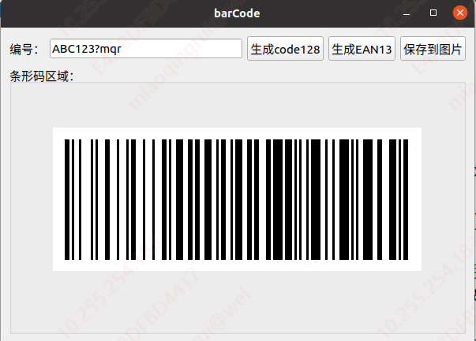
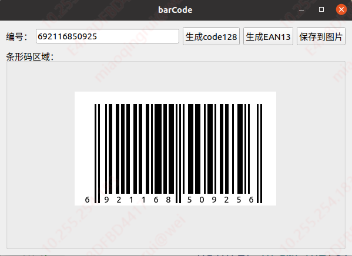
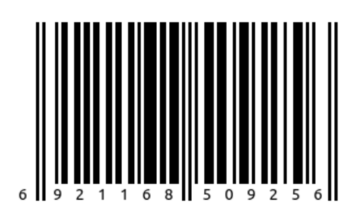

# barCode
这是一个生成条形码的小程序
## 功能概述:
该程序主要实现了code128B型条码和EAN13条码的编码与生成，关于这两种条码的编码规则，详细可参考doc目录下的文档，这里不再赘述。下面仅大致说明一下代码结构:
```
BarCode：条形码的编码类，该类的主要功能就是将条形码所表示的数字/字符等，按照指定的编码规则生成bs(10)串，也就是黑条和空白。
BarCodebox：该类负责画条形码，使用Qt的QPainter按照bs(10)串的顺序画黑条和空白，最终在界面显示条码。
Widget：该类负责界面的布局以及功能调用之间的逻辑（其实没多少功能）
```
## 运行截图:
  
  
  
## 小结:
这个程序是在2016年刚到公司实习时，针对一个小需求写的。当时太年轻，接到需求就开始着手研究条形码的编码规则，写了这么一个比较low的小程序，而完全没有想到其实有很多成熟的条形码编码及生成库可以用。虽然是重复的制造了一个很普通的轮子，但对于当时来讲，也算是有比较大的收获吧。当然写这么个轮子的更主要的原因是条形码的编码规则相对还算简单，之后又研究了一阵QRcode的编码规则，因为算法太过于复杂，果断用了现成的编码库。  
现在回看当时写的代码，感觉还是有很多优化的地方，但是现在吧，没之前勤奋了，就这么着吧。。。。。。
## 作者联系方式
**邮箱:justdoit_mqr@163.com**  
**新浪微博:@为-何-而来**  